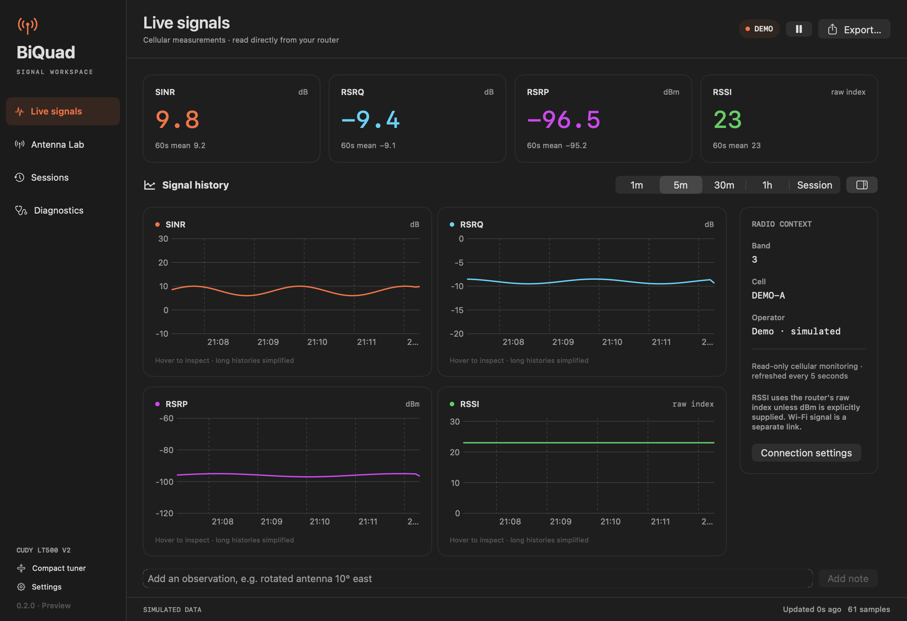

# BiQuad Monitor

A native macOS menu-bar monitor and antenna experiment workspace for supported Cudy cellular routers. Read SINR, RSRQ, RSRP and RSSI directly from the router, record antenna trials, and compare saved measurements.

**0.2.0 is an unsigned Universal release for Intel and Apple Silicon.** Download it from [GitHub Releases](https://github.com/subkoks/BiQuadMonitor/releases/latest). It has an ad-hoc integrity signature, no Developer ID signature and no notarization. macOS may block its first launch; use the per-app **Open Anyway** option in Privacy & Security if you choose to run it. Current evidence and unverified platform/stability checks are listed in [Compatibility](docs/compatibility.md).

To install, unzip the download and move **BiQuad Monitor.app** to Applications. Quit any older running copy before opening the new version. Keep the previous app and your local measurement history for rollback.

```text
LTE BAND 3 | SINR 8 | RSRQ −9 | RSRP −96 | RSSI 23
```

The numbers above are an example. RSSI `23` is the Cudy's **raw index**, not dBm.

## What it does

- **Compact tuner:** large SINR reading, all four metrics, 60-second means, trial progress, pause/resume, and an optional floating window.
- **Signal workspace:** four linked history charts, time-range controls, radio context, and timestamped observations. Missing samples and connection gaps break the lines.
- **Antenna Lab:** separate settling and recording periods; named trials with orientation and notes; reference comparisons using medians, P10–P90 and interquartile range. Changes are shown only for matching, known band/cell/units.
- **Local history:** SQLite sessions survive restarts. Experiment sessions are pinned automatically. Cleanup of older, closed, unpinned sessions is an explicit action.
- **CSV and JSON export:** every stored sample in a selected session, including trial phases and events. Cell identifiers and names/notes are excluded by default.
- **Personalization:** full, compact or custom menu labels; dark, light or system appearance; optional SINR target sound.

Demo and rendered preview images use **simulated data**. They demonstrate the interface, not reception or router compatibility.



[View the compact tuner](docs/screenshots/compact-demo.png). Both images use simulated data.

## Build and connect

Install full Xcode with its macOS SDK, select it as the active developer directory, and have Python 3 available. Then, from this repository:

```sh
python3 build_app.py
open 'dist/preview/BiQuad Monitor.app'
```

The default build contains both `x86_64` and `arm64` slices. For a faster build on the current Mac, use `python3 build_app.py --arch native`. Build provenance is written to `dist/preview/build.json`.

In **Settings → Router**, enter the router's private IPv4 address and web-admin password. The usual address for the tested setup is `192.168.10.1`. Match HTTP/HTTPS to the working router admin page; HTTPS requires a trusted certificate. Click **Connect** and allow Local Network access if macOS asks. Wi-Fi on the router's LAN is sufficient; an Ethernet cable is optional.

Click the menu-bar readings to open the compact tuner. With an app window active, **⌘1** opens the tuner, **⌘2** opens the workspace, and **⌘,** opens Settings. Choose **Demo** in Settings to try the interface without a router.

See the [User guide](docs/user-guide.md) for trials, exports and connection troubleshooting.

## Data and access

BiQuad Monitor uses the router's web login and cellular status endpoint. Monitoring changes no router settings and sends no SSH, AT or SMS commands. Password storage in this Mac's Keychain is optional. Browser passwords and browser sessions are not accessed.

Measurements stay on this Mac in `~/Library/Application Support/BiQuadMonitor/measurements.sqlite`. There is no cloud service or telemetry. HTTP is unencrypted on the LAN; HTTPS certificate verification is always enabled. Read the [Security and privacy notes](SECURITY.md) before sharing diagnostics or exports.

## Development

```sh
swift test
python3 scripts/check.py
python3 scripts/check.py --ui
```

The first command runs offline unit, transport and storage tests. The check runner adds source-publication and window/coordinator checks; `--ui` adds native XCUITest interaction checks and requires a usable macOS GUI session. Passing offline checks does not establish physical-router, Finder permission, or hardware acceptance.

The code uses SwiftUI, AppKit, Swift Charts and system SQLite, with no third-party runtime packages. [Contributing](CONTRIBUTING.md), [Codex + GitHub automation](docs/automation.md), and the [release checklist](docs/release.md) describe the workflow.

Independent project, unaffiliated with Cudy. Source is available under the [MIT License](LICENSE).
